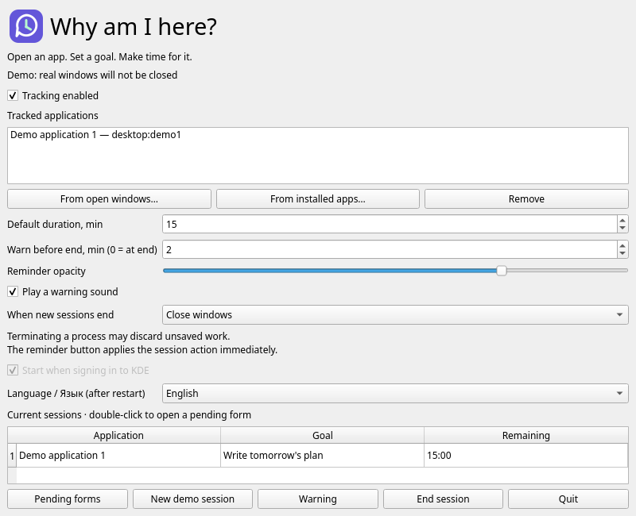

<p align="center">
	
</p>

<p align="center">
	<strong>Use your apps with purpose, not out of habit.</strong><br>
	Linux · KDE Plasma 6 · Wayland · Python / PySide6 · MIT
</p>

<p align="center">
	<a href="README.ru.md">Русский</a> · <strong>English</strong>
</p>

**Why am I here?** asks why you opened a tracked app and how much time you want to spend in it. A floating reminder displays your goal and countdown. When time runs out, it closes the windows or force quits the application, according to your chosen mode.



## Features

- Automatic window detection through KWin; select installed apps or open windows.
- Pending apps are minimized and cannot be selected until their goal form is answered.
- One shared session for all windows of an app, with independent timers for different apps.
- A draggable, translucent reminder that does not take keyboard focus.
- A red warning and a single sound before time runs out.
- **End session now**, system tray controls and optional autostart.
- Suggestions from the ten most recent goals for each app and 5, 15 and 30 minute shortcuts.
- English and Russian interfaces using the KDE system palette.
- Local settings with no accounts or analytics.

## Requirements

**Linux with KDE Plasma 6 and Wayland**, Python **3.10+**, PySide6 **6.7+**. The main test environment is EndeavourOS, Plasma 6.7.4, Python 3.14 and PySide6 6.11.2. Plasma 5 and other desktop environments are not supported.

On Arch / EndeavourOS, install `python` if needed. On Debian / Ubuntu with Plasma 6 already installed, you may need `python3`, `python3-venv`, `libegl1`, `libopengl0`, `libxkbcommon0`, `libxcb-cursor0` and `libpulse0`. These libraries support Qt graphics and audio.

## Quick start

Download or clone the source and open a terminal in the repository root:

```bash
python3 -m venv .venv
.venv/bin/python -m pip install -e .
.venv/bin/why-here --demo --language en
```

Click **New demo session**. The demo does not connect to KWin, save settings or terminate real applications.

For normal use:

```bash
.venv/bin/why-here --language en
```

Add an app, open one of its windows, enter your goal and duration, then click **Start**. No countdown runs before you answer. Switching windows or working in the background does not reset the timer.

## Install

Download the Linux archive from [GitHub Releases](https://github.com/hlophlopgaming/whyiamhereDesktop/releases), extract it and run:

```bash
./why-here
```

The portable build does not add a KDE menu entry. Its autostart checkbox creates a local XDG entry for the extracted executable, so keep the file in a permanent location before enabling it.

For a source installation, use the virtual environment from Quick start. The standard entry point is `.venv/bin/why-here`; no custom installer is required.

Select **Language / Язык (after restart)**, quit through the tray and reopen to apply it. You can also specify the language explicitly:

```bash
.venv/bin/why-here --language ru
```

If the app is already running, a second launch opens its existing window.

## How sessions end

| Mode | At the deadline or via End session now | Dismissing an unanswered form |
| --- | --- | --- |
| **Close windows** — default | Normal close request; the app may ask you to save | The form stays open until a session is started |
| **Force quit application (SIGKILL)** | Terminates window-owner processes and their current descendants | The close button, Escape or Alt+F4 also force quits the app |

**SIGKILL does not offer a chance to save: unsaved work may be lost.** The action is fixed when a timer starts; dismissing a pending form uses the current setting. There is no Later button.

Closing the last normal window ends its session. Disabling tracking, removing an app from the list or quitting this utility cancels sessions without terminating tracked apps. Closing the utility's main window hides it in the tray.

## Local data and limitations

- Settings: `~/.config/why-here/settings.json`; autostart: `~/.config/autostart/org.local.WhyHere.desktop`. XDG path overrides are respected.
- The ten most recent unique goals for each app are stored locally for autocomplete. Timers remain in memory only, so open apps receive new forms after a restart.
- Time spent asleep counts toward the deadline. Overdue sessions apply their action after resume.
- Apps are identified by KWin IDs, not window titles. For unusual IDs, select an open window. Flatpak catalogues are supported, but individual apps need testing.
- Force quit uses Linux pidfds. This utility, protected system processes and processes shared by different apps are excluded. Detached services and external automatic restarts are not controlled.
- Use **Reconnect KWin** if the connection is lost. Blocking and focus enforcement require an active KWin connection.

## Test and build

```bash
.venv/bin/python -m unittest discover -s tests -v
QT_QPA_PLATFORM=offscreen .venv/bin/python -m tests.gui_smoke
QT_QPA_PLATFORM=offscreen .venv/bin/python -m tests.startup_smoke
QT_QPA_PLATFORM=offscreen .venv/bin/python -m tests.english_smoke
```

Real KWin tests, including SIGKILL, are described in [TESTING.md](TESTING.md). GitHub Actions checks logic and headless GUI behavior; it does not replace testing in KDE.

Build one executable:

```bash
.venv/bin/python -m pip install -r requirements-build.txt
.venv/bin/python build_binary.py
./dist/why-here --demo --language en
```

The executable includes Python and Qt but still depends on Linux system libraries. Building on a newer distribution does not guarantee compatibility with older ones. `build/` and `dist/` are excluded from Git; binaries belong in GitHub Releases. A standalone executable does not install its own menu entry; autostart is configured from the app settings.

Create a release by pushing a version tag: `git tag v0.3.0 && git push origin v0.3.0`. The workflow checks that the tag matches `pyproject.toml`, runs the tests and publishes the binary with its SHA-256 checksum.

## Uninstall

Disable autostart in Settings, then remove the extracted release directory or `.venv` from a source checkout. To clear preferences and goal suggestions, remove `~/.config/why-here`.

## Project layout

| Files | Purpose |
| --- | --- |
| `why_here/core.py` | Sessions and timers |
| `why_here/gui.py`, `i18n.py`, `assets/` | UI, translations and brand assets |
| `why_here/bridge.py`, `kwin.js` | KWin integration over D-Bus |
| `why_here/processes.py`, `storage.py` | Process handling and local settings |
| `tests/` | Automated and integration checks |
| `pyproject.toml`, `build_binary.py` | Python package and executable packaging |

[Testing](TESTING.md)

## License

Original project code, documentation and brand assets are available under the **[MIT License](LICENSE)**. Dependencies retain their own licenses; see [THIRD_PARTY.md](THIRD_PARTY.md).
