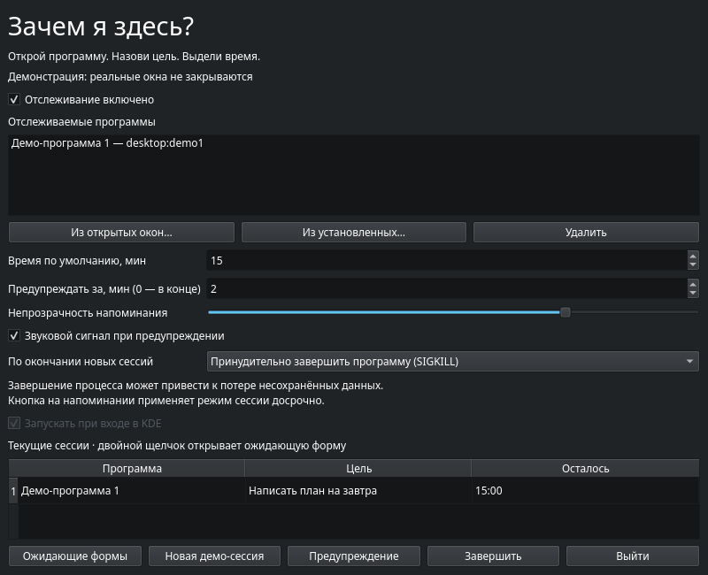

<p align="center">
	
</p>

<p align="center">
	<strong>Пользуйтесь программами с целью, а не по привычке.</strong><br>
	Linux · KDE Plasma 6 · Wayland · Python / PySide6 · MIT
</p>

<p align="center">
	<strong>Русский</strong> · <a href="README.en.md">English</a>
</p>

**«Зачем я здесь?»** спрашивает, зачем вы открыли выбранную программу и сколько времени хотите в ней провести. Затем показывает цель и обратный отсчёт поверх окон. По окончании — закрывает окна или принудительно завершает программу, в зависимости от выбранного режима.



## Возможности

- Автоматическое обнаружение окон через KWin; добавление из установленных приложений или открытых окон.
- Одна общая сессия для всех окон программы и независимые таймеры разных программ.
- Перетаскиваемое полупрозрачное напоминание без захвата клавиатурного фокуса.
- Красное предупреждение и однократный звук перед окончанием времени.
- Кнопка **«Завершить сейчас»**, системный трей и автозапуск.
- Русский и английский интерфейс, системная палитра KDE.
- Локальные настройки, без аккаунтов, аналитики и истории целей.

## Требования

**Linux с KDE Plasma 6 и Wayland**, Python **3.10+**, PySide6 **6.7+**. Основное тестовое окружение: EndeavourOS, Plasma 6.7.4, Python 3.14, PySide6 6.11.2. Plasma 5 и другие рабочие окружения не поддерживаются.

На Arch / EndeavourOS при отсутствии Python установите `python`. На Debian / Ubuntu с уже установленной Plasma 6 могут потребоваться `python3`, `python3-venv`, `libegl1`, `libopengl0`, `libxkbcommon0`, `libxcb-cursor0`, `libpulse0`. Эти библиотеки обеспечивают работу графики и звука Qt.

## Быстрый запуск

Скачайте исходники или клонируйте репозиторий, откройте терминал в его корневой папке:

```bash
python3 -m venv .venv
.venv/bin/python -m pip install -r requirements.txt
.venv/bin/python -m why_here --demo
```

Нажмите **«Новая демо-сессия»**. Демонстрация не подключается к KWin, не сохраняет настройки и не закрывает реальные программы.

Для обычной работы:

```bash
.venv/bin/python -m why_here
```

Добавьте программу, откройте её окно, введите цель и время, нажмите **«Начать»**. До ответа отсчёт не идёт. Переключение между окнами и работа в фоне не сбрасывают таймер.

## Установка в меню KDE

```bash
python3 install.py
```

Установка для текущего пользователя, без `sudo`: отдельное окружение и приложение размещаются в `~/.local/share/why-here`, иконка и пункт меню добавляются в пользовательские каталоги KDE. Зависимости скачиваются только при установке. Автозапуск включается флажком в настройках. Повторная установка обновляет приложение, сохраняя настройки.

Выбор **«Язык / Language (после перезапуска)»** применяется после выхода через трей и повторного запуска. Можно указать язык явно:

```bash
.venv/bin/python -m why_here --language en
```

Если программа уже работает, повторный запуск открывает существующее окно.

## Как завершаются сессии

| Режим | По окончании или по кнопке «Завершить сейчас» | Закрытие формы без ответа |
| --- | --- | --- |
| **Закрыть окна** — по умолчанию | Обычный запрос закрытия; программа может предложить сохранить документ | Форма остаётся ожидающей, доступна через трей |
| **Принудительно завершить программу (SIGKILL)** | Завершение процессов владельцев окон и их текущих потомков | Крестик, Escape или Alt+F4 также принудительно завершают программу |

**SIGKILL не даёт сохранить документы: несохранённые данные могут потеряться.** Режим фиксируется при начале таймера; закрытие ожидающей формы использует текущую настройку. Кнопки «Позже» нет.

Закрытие последнего обычного окна завершает сессию. Отключение отслеживания, удаление программы из списка и выход из самой утилиты отменяют сессии без завершения программ. Закрытие главного окна утилиты прячет её в трей.

## Локальные данные и ограничения

- Настройки: `~/.config/why-here/settings.json`; автозапуск: `~/.config/autostart/org.local.WhyHere.desktop`. Учитываются XDG-переменные путей.
- Цели и таймеры хранятся только в памяти. После перезапуска открытые программы получают новые формы.
- Таймер учитывает сон компьютера. После пробуждения просроченная сессия применяет выбранное действие.
- Приложения определяются по ID KWin, а не по заголовкам. При нестандартном ID добавьте программу через открытое окно. Flatpak-каталоги поддержаны, но конкретные приложения требуют проверки.
- Принудительное завершение использует Linux pidfd. Собственные, служебные и общие для разных приложений процессы защищены. Отдельные службы, отделившиеся процессы и внешний автоматический перезапуск не контролируются.
- При потере связи нажмите **«Переподключить KWin»**. Ограничения Wayland могут мешать автоматическому поднятию формы; откройте её из трея.

## Проверка и сборка

```bash
.venv/bin/python -m unittest discover -s tests -v
QT_QPA_PLATFORM=offscreen .venv/bin/python -m tests.gui_smoke
QT_QPA_PLATFORM=offscreen .venv/bin/python -m tests.startup_smoke
QT_QPA_PLATFORM=offscreen .venv/bin/python -m tests.english_smoke
```

Настоящие тесты KWin, включая SIGKILL, описаны в [TESTING.md](TESTING.md). GitHub Actions проверяет логику и GUI без дисплея; это не заменяет проверку в KDE.

Сборка одного исполняемого файла:

```bash
.venv/bin/python -m pip install -r requirements-build.txt
.venv/bin/python build_binary.py
./dist/why-here --demo
```

Бинарник содержит Python и Qt, но зависит от системных библиотек Linux. Сборка на новом дистрибутиве не гарантирует запуск на старом. Каталоги `build/` и `dist/` исключены из Git; готовые сборки предназначены для GitHub Releases. Сам бинарник не устанавливает пункт меню или автозапуск.

## Удаление

```bash
python3 install.py --uninstall
# Также удалить настройки:
python3 install.py --uninstall --purge
```

Если исходники удалены: `python3 ~/.local/share/why-here/install.py --uninstall`. Удаляются установленная копия, окружение, иконка, пункт меню, автозапуск и загруженный скрипт KWin. Исходная папка остаётся.

## Устройство проекта

| Файлы | Назначение |
| --- | --- |
| `why_here/core.py` | Сессии и таймеры |
| `why_here/gui.py`, `i18n.py`, `assets/` | Интерфейс, переводы и логотипы |
| `why_here/bridge.py`, `kwin.js` | Интеграция с KWin через D-Bus |
| `why_here/processes.py`, `storage.py` | Управление процессами и локальные настройки |
| `tests/` | Автоматические и интеграционные проверки |
| `install.py`, `build_binary.py` | Установка и сборка |

[Участие в разработке](CONTRIBUTING.md) · [Проверки](TESTING.md)

## Лицензия

Оригинальный код, документация и логотипы проекта распространяются по **[MIT](LICENSE)**. Зависимости сохраняют собственные лицензии — см. [THIRD_PARTY.md](THIRD_PARTY.md).
